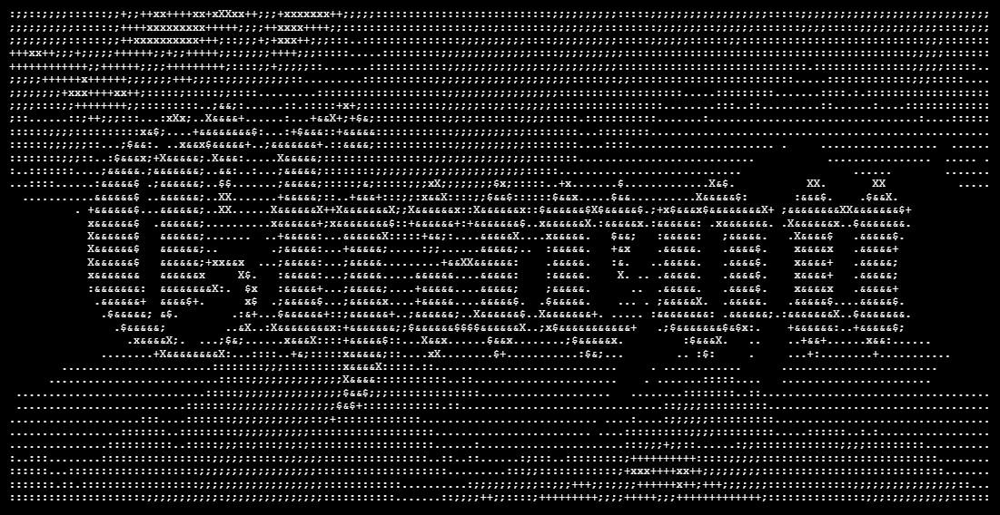

# CHARON

Terminal user interface for [SHADOW](https://github.com/ENIX1701/SHADOW) written in Rust. Not the prettiest, but really functional.  

// GIF

## Prerequisites

- `Rust` (2024) with `Cargo`
- `Perl`, `Make` and either `gcc`, `clang` or `musl-dev` to build vendored `openssl`

or  

- `Docker` if you want to go the easy route :3

## Run locally

```bash
# clone the project and navigate to its directory
git clone https://github.com/ENIX1701/CHARON
cd CHARON

# install dependencies and run via Cargo
cargo run
```

## Deploy

CHARON is built with native Docker support in mind. A lightweight, multi-stage `Dockerfile` is included to ensure the experience is as smooth as possible.

```bash
# build the image
docker build -t charon .

# run the container in interactive tty mode
docker run -it -e SHADOW_URL="127.0.0.1" charon
```

## Environment variables

| Name              | Type   | Default          | Description                           |
|-------------------|--------|------------------|---------------------------------------|
|`SHADOW_URL`       |`String`|`127.0.0.1`       | IP or URL of the SHADOW C2 server     |
|`SHADOW_PORT`      |`String`|`9999`            | Port the SHADOW API is listening on   |
|`SHADOW_API_PATH`  |`String`|`/api/v1/charon`  | Base path for the SHADOW API          |

## Usage

Please navigate to the [user manual](docs/MANUAL.md) section of the documentation for usage reference.

## Roadmap

- [x] GHOST payload builder
- [x] Code refactor and modularization
- [ ] Local cache
- [ ] Improved GHOST state management (automatic inactive or manual cleanup)
- [x] Update the MANUAL with new features (and refresh the old ones)
- [ ] Tab listing ready GHOST binaries (with arguments/build parameters)

## Legal

> [!IMPORTANT]
> This software is for educational purposes and authorized red team engagements only. The authors are not responsible for misuse.

---

Special thanks to [awesome-readme](https://github.com/matiassingers/awesome-readme) for README ideas and to [readme.so](https://readme.so/) for helping me make this one coherent at all :3
