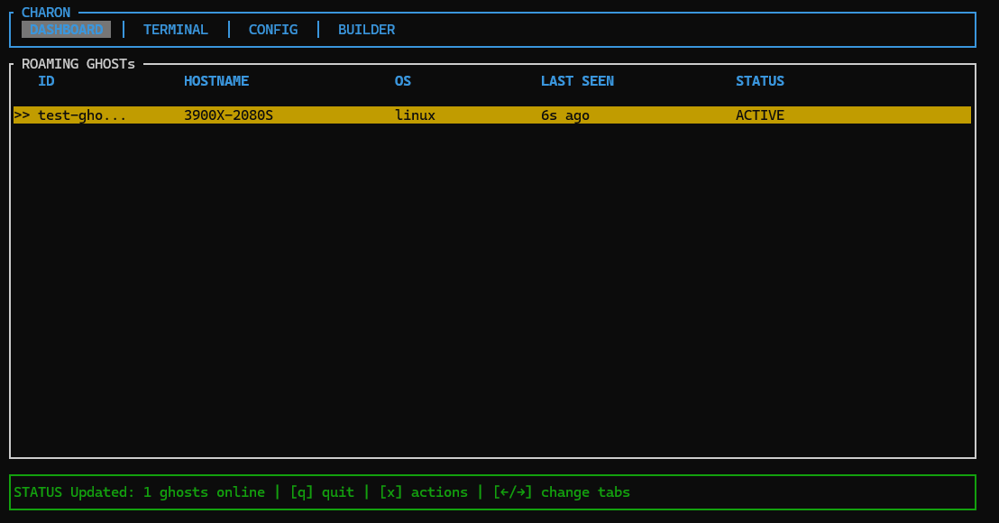
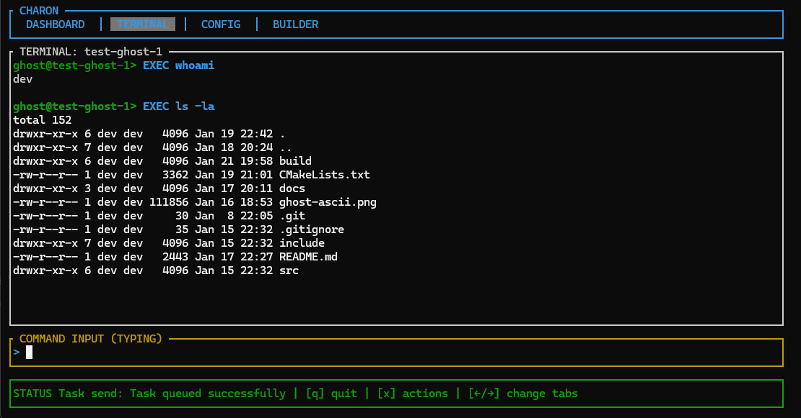
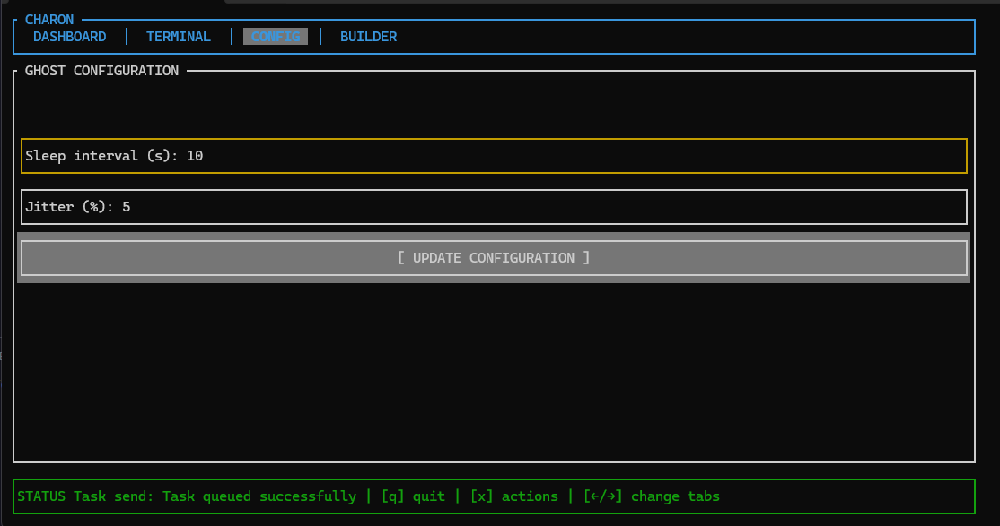
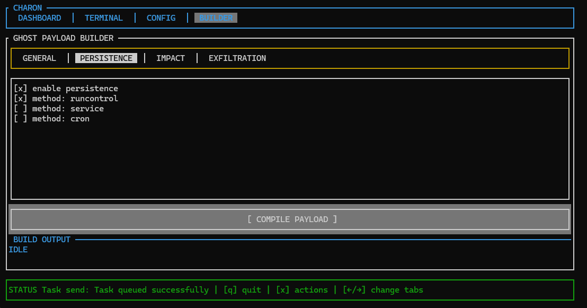
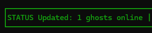

# CHARON user manual

CHARON is a terminal-based user interface for managing SHADOW C2 implants (called GHOSTs). It uses a tab-based layout to separate monitoring, interaction and configuration tasks. This also makes it open to future expansion, which is a nice bonus :3

## Global navigation

These controls apply regardless of the currently active tab.

|Key    | Action        |
|-------|---------------|
| `←/→` | Switch tabs   |
| `h`   | Toggle help   |
| `q`   | Quit          |

## Tabs

The interface is comprised of 4 main tabs. Each of them serves a unique purpose, but may depend on the state of another one. These relations will be outlined in the respective section for each. 

### Dashboard

This is the default view. It displays all GHOSTs connected to the SHADOW server and basic information about them.

#### Navigation

|Key    | Action        |
|-------|---------------|
| `x`   | GHOST actions |
| `r`   | Force refresh |

### Terminal

Terminal window allows easy GHOST management. This window operates on a GHOST currently selected in the dashboard panel.

The types of commands you can run are:
| Command           | Args                  | Description                                                                       |
|-------------------|-----------------------|-----------------------------------------------------------------------------------|
| `EXEC` (default)  | `<command to run>`    | Executes command provided on GHOSTs system                                        |
| `IMPACT`          | `-`                   | Executes the configured IMPACT module of a GHOST (parametrizable in compilation)  |
| `STOP_HAUNT`      | `-`                   | Kills GHOST, which then cleans up and self destroys                               |

> [!NOTE]
> If no explicit command is provided (so you input `whoami` into the terminal, for example), CHARON defaults to `EXEC`

#### Navigation

| Key   | Action                                    |
|-------|-------------------------------------------|
| `i`   | Focus COMMAND INPUT window                |
| `ESC` | If COMMAND INPUT focused, it defocuses it |

### Config

This tab is used to send configuration changes to the CHOST currently selected on dashboard panel. Input fields require integer numeric input.

#### Navigation

|Key        | Action                                                            |
|-----------|-------------------------------------------------------------------|
| `↑/↓`     | Navigate up/down                                                  |
| `TAB`     | Navigate to the next field                                        |
| `ENTER`   | Navigate to the next field or submit if focused on the last one   |

### Builder

This tab allows the creation of custom GHOSTs. 

#### SHADOW configuration

`SHADOW_URL` - IP or URL of the SHADOW C2 server
`PORT` - port of the aforementioned server

#### Modules

For what each module does, please refer to [GHOST docs](https://github.com/ENIX1701/GHOST/docs/FUNCTIONALITY.md).

#### Resulting binary

Once configured, select `[ COMPILE PAYLOAD ]` to build the binary. It will be placed in GHOST's build directory (`GHOST/build/bin/Ghost` relative to AETHER).

## Status indicators

Bottom of the window shows current status of CHARON. Below is a very short guide to interpreting it.

| Color     | Description           |
|-----------|-----------------------|
| 🟩        | Operating normally    |
| 🟥        | Error                 |
