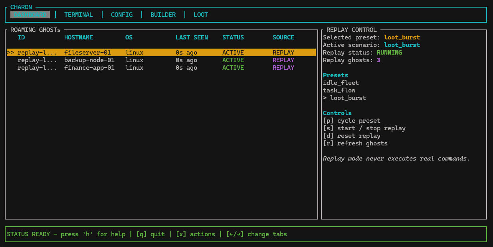
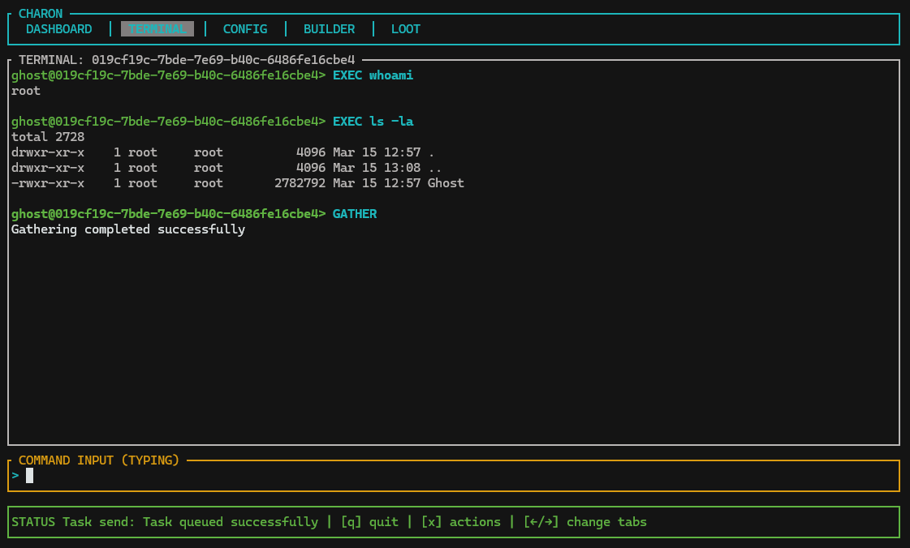
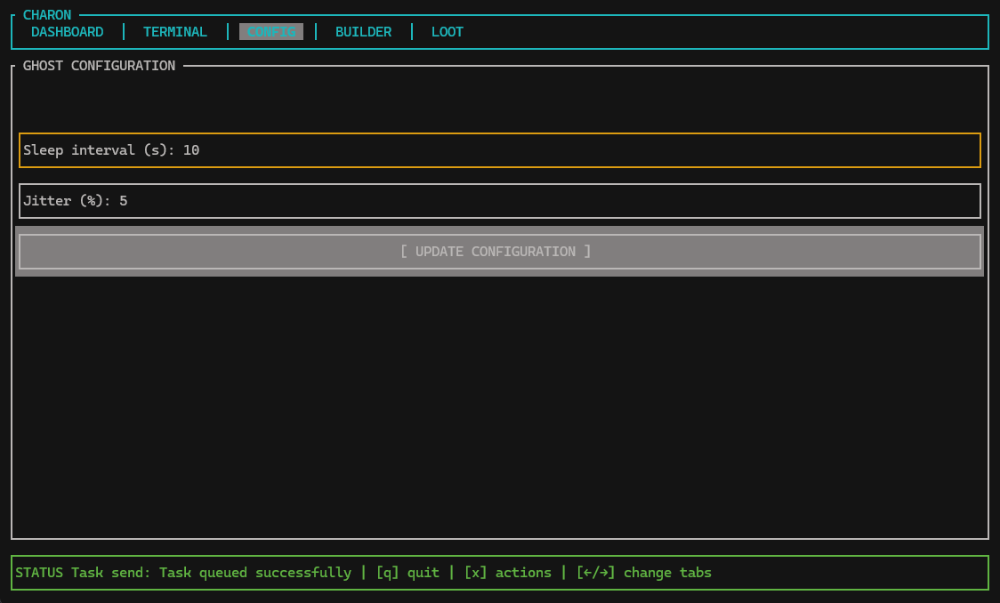
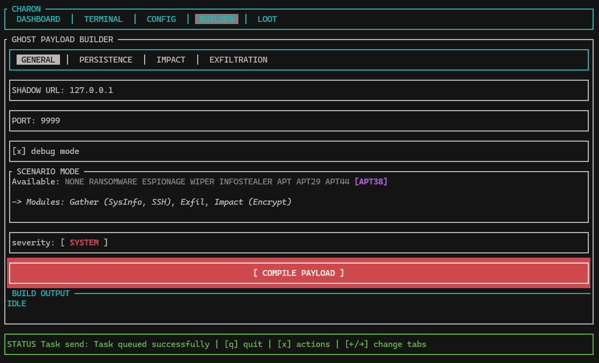
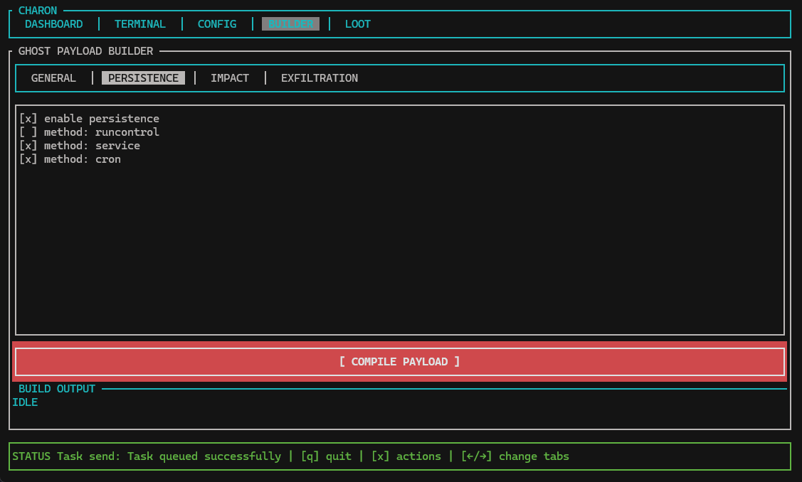
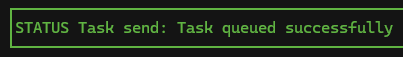

# CHARON user manual

CHARON is a terminal-based user interface for managing SHADOW C2 implants (called GHOSTs). It uses a tab-based layout to separate monitoring, interaction and configuration tasks. This also makes it open to future expansion, which is a nice bonus :3

## Global navigation

These controls apply regardless of the currently active tab.

| Key   | Action        |
|-------|---------------|
| `←/→` | Switch tabs   |
| `h`   | Toggle help   |
| `q`   | Quit          |

## Tabs

The interface is comprised of 4 main tabs. Each of them serves a unique purpose, but may depend on the state of another one. These relations will be outlined in the respective section for each. 

### Dashboard

This is the default view. It displays all GHOSTs connected to the SHADOW server and basic information about them.

#### Navigation

|Key    | Action        |
|-------|---------------|
| `x`   | GHOST actions |
| `r`   | Force refresh |

### Terminal

Terminal window allows easy GHOST management. This window operates on a GHOST currently selected in the dashboard panel.

The types of commands you can run are:
| Command           | Args                  | Description                                                                       |
|-------------------|-----------------------|-----------------------------------------------------------------------------------|
| `EXEC` (default)  | `<command to run>`    | Executes command provided on GHOSTs system                                        |
| `IMPACT`          | `-`                   | Executes the configured IMPACT module of a GHOST (parametrizable in compilation)  |
| `STOP_HAUNT`      | `-`                   | Kills GHOST, which then cleans up and self destroys                               |

> [!NOTE]
> If no explicit command is provided (so you input `whoami` into the terminal, for example), CHARON defaults to `EXEC`

#### Navigation

| Key   | Action                                    |
|-------|-------------------------------------------|
| `i`   | Focus COMMAND INPUT window                |
| `ESC` | If COMMAND INPUT focused, it defocuses it |

### Config

This tab is used to send configuration changes to the CHOST currently selected on dashboard panel. Input fields require integer numeric input.

#### Navigation

|Key        | Action                                                            |
|-----------|-------------------------------------------------------------------|
| `↑/↓`     | Navigate up/down                                                  |
| `TAB`     | Navigate to the next field                                        |
| `ENTER`   | Navigate to the next field or submit if focused on the last one   |

### Builder

This tab allows the creation of custom GHOSTs. 

#### SHADOW configuration

`SHADOW_URL` - IP or URL of the SHADOW C2 server
`PORT` - port of the aforementioned server

#### Modules

Allows you to configure which modules will be present in the output binary. The *Module* must be enabled to toggle the *Methods*.

For what each *Module* does, please refer to [GHOST docs](https://github.com/ENIX1701/GHOST/docs/FUNCTIONALITY.md).

#### Scenarios

Scenarios are presets simulating certain threats and/or threat actors. They're described [in the GHOST build docs](https://github.com/ENIX1701/GHOST/blob/main/docs/BUILD.md#scenario-mode). Here is an excerpt from that:

| Option                | Description                                                                                                                                       |
|-----------------------|---------------------------------------------------------------------------------------------------------------------------------------------------|
| `RANSOMWARE`          | Very noisy. Exfiltrates data and encrypts files.                                                                                                  |
| `ESPIONAGE`           | Low noise. Gathers host info (sensitive data included!) and exfiltrates it over the C2 channel. Good starting point for simulating [infostealer malware](https://en.wikipedia.org/wiki/Infostealer) or [APT actors](https://www.ibm.com/think/topics/advanced-persistent-threats) :3  |
| `WIPER`               | Extreme noise. Destroys all files and self-terminates, leaving the system in an unusable state. Used to test EDR detection and reaction speed.    |
| `INFOSTEALER`         | Steals the info >:3c                                                                                                                              |
| `APT`                 | Stealhy and hands-on-keyboard'y... Also - very generic                                                                                            |
| `APT29`               | Long-term espionage. Gathers SSH keys, stablishes RunControl persistence and deploys an undetectable 4-hour beacon interval.                      |
| `APT44 (SANDWORM)`    | Pure chaos. Establishes a CRON job to survive reboots and immediately wipes the system. Nothing will survive.                                     |
| `APT38 (LAZARUS)`     | Two stage extortion. Silent harvesting of system data and SSH keys only to drop a screaming ransomware to mask the espionage.                     |

#### Impact level

Described in detail in [GHOST build docs](https://github.com/ENIX1701/GHOST/blob/main/docs/BUILD.md#impact-severity). The summary is as follows:

| Severity          | Description                                                                                           |
|-------------------|-------------------------------------------------------------------------------------------------------|
| `TEST` (default)  | The safe mode. Boring and predictable. Uses dummy files to simulate functionality.                    |
| `USER`            | Contained to user-level data. Can be destructive, but only withing the realms of a single user.       |
| `SYSTEM`          | System-level impact. Can deem the machine unusable and irrecoverable. Use with **EXTREME** caution.   |

#### Resulting binary

Once configured, select `[ COMPILE PAYLOAD ]`.

CHARON will send the build configuration to SHADOW, that will then compile the binary and make it available for download. The download path will be displayed in the status bar upon success.

### Loot

This tab allows you to manage data exfiltrated by GHOSTS :3

#### Navigation

|Key            | Action                                                            |
|---------------|-------------------------------------------------------------------|
| `/` or `s`    | Enter search mode to filter files by name                         |
| `ESC`         | Exit search mode                                                  |
| `↑/↓`         | Navigate up/down                                                  |
| `ENTER`       | Download the selected file to the local `loot/` directory         |
| `r`           | Refresh the loot list                                             |

## Status indicators

Bottom of the window shows current status of CHARON. Below is a very short guide to interpreting it.

| Color     | Description           |
|-----------|-----------------------|
| 🟩        | Operating normally    |
| 🟥        | Error                 |
